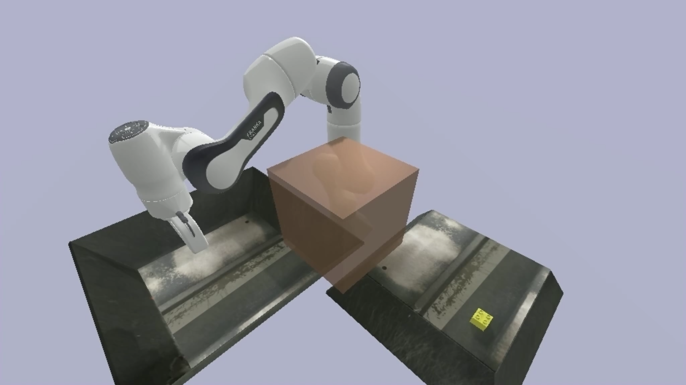

# CS5478-Project
Grasping objects is a classic problem in the field of robotic control, involving critical challenges such as motion planning and grasp position prediction. Motion planning ensures that the robot navigates without colliding with obstacles, while grasp position prediction enables the robot to identify the most optimal position for grasping objects. In this project, we have constructed a simulated environment using PyBullet to compare various motion planning algorithms. Additionally, we employed the GQ-CNN neural network for precise grasp position prediction. A range of metrics has been designed for a comprehensive evaluation of these algorithms. Our study not only addresses key challenges in robotic control but also contributes to the advancement of robotic manipulation techniques in practical applications.

# Requirements

Python version is 3.8.

Tensorflow version is 1.15.5 and numpy version is 1.18.5. 

The version of numpy changes as subsequent libraries are installed, which in turn leads to conflicts with the tensorflow version. You need to make sure that the version of tensorflow is 1.15.5 and the version of numpy is 1.18.5. Then, look for other third-party library versions that meet both of these two requirements.

Install pybullet and gqcnn by `pip install pybullet gqcnn`.

Follow the [instruction](https://github.com/lyfkyle/pybullet_ompl) to install ompl.

## Usage

Run demo: `python demo.py`.

Run complete process experiment: `python motion_plan_and_grasp_exp.py`.

Run grasp position predicting experiment: `python grasp_exp.py`.

Run motion planning experiment: `python motion_plan_exp.py`.

The experiment results will be saved in exp_results/.

## License
[MIT License](./LICENSE)
